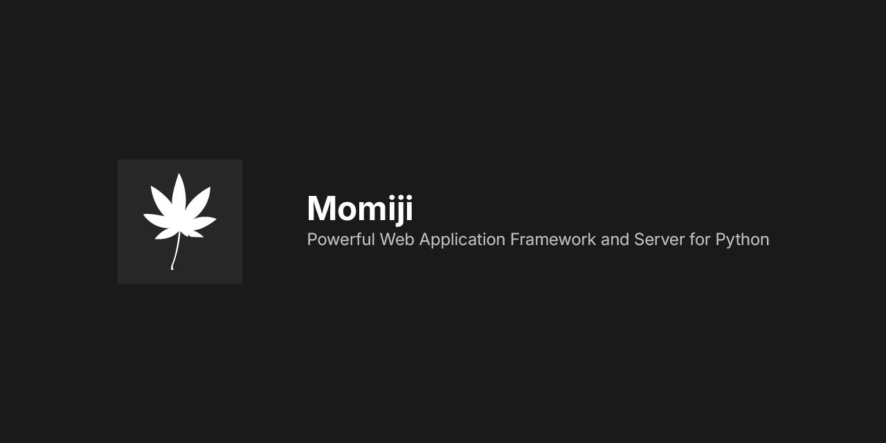

# Momiji
A powerful web application framework and server for Python

## What is Momiji?
Momiji is a web application framework and its server for Python.

Momiji has been developed with a focus on being both simple and powerful.
It includes features generally required for web servers, such as response compression and content minification, without any extraneous functionality.

## Features
Due to its simple structure, Momiji is relatively easy to use.

For example, a server that simply returns "Hello, World!" can be created in just a few lines of code:

```python
from momiji import Server, App, Response

class MyApp(App):
    def __call__(self, request):
        return Response("Hello, World!".encode(), content_type="text/plain")

if __name__ == "__main__":
    server = Server(MyApp())
    server.run()
```

The structure like Server/App/Response is inspired by ASGI.

## (Likely) Frequently Asked Questions

### It's too simple. What is this!
Yes, it is very simple. Is there a problem with that?

### I found a repository called Aki. It seems related to Momiji... what is it?
Momiji is very simple, but it does not have smart features like FastAPI that "define endpoints and route automatically."

Aki is a library planned for development that aims to make Momiji usable with the same feel as FastAPI.

### I read `pyproject.toml` and noticed that aioquic is configured to use `nercone-forks/aioquic` instead of the original. Why is this?
The original aioquic does not support PQC (Post-quantum Cryptography).
However, (knowing about Harvest now, Decrypt later attacks) I believe all websites should support PQC, so I forked aioquic and added PQC support to it.

I have already sent a pull request to the original repository and plan to switch back to it once it is merged.

Note that while developing Momiji, I found a fork called `qh3`. It seems that fork also supports PQC, and since development on the original repository has stagnated, I plan to switch to qh3 if my pull request does not seem likely to be merged.
